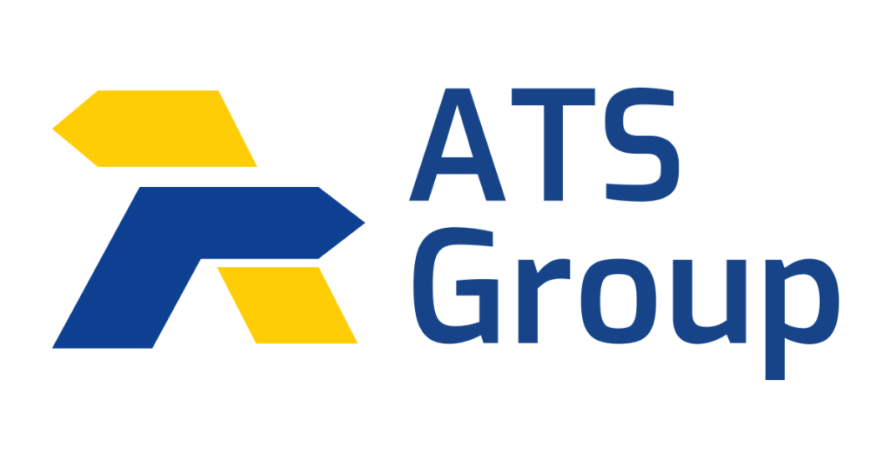

# ATS BOM Automation Tool v1.0

<p align="center">
  
</p>

<p align="center">
  <strong>Convert Vault CSV Exports into Clarity ERP Import Files</strong><br>
  <em>Developed by ATS Automation Team</em>
</p>

---

## 📋 Table of Contents

- [Overview](#overview)
- [Features](#features)
- [Screenshots](#screenshots)
- [System Requirements](#system-requirements)
- [Installation](#installation)
- [Usage Guide](#usage-guide)
- [Integrated Scripts](#integrated-scripts)
- [Output Files](#output-files)
- [Folder Structure](#folder-structure)
- [Troubleshooting](#troubleshooting)
- [Support](#support)

---

## Overview

The **ATS BOM Automation Tool** is a professional desktop application designed for the manufacturing engineering team at ATS Group. It streamlines the process of converting **Autodesk Vault CSV exports** into **Clarity ERP-compatible Excel import files** — eliminating manual data transformation and reducing errors.

### What It Does

```
Vault CSV Export  ──►  ATS BOM Automation Tool  ──►  Clarity ERP Import Files
                                                      ├── Item Import (.xlsx)
                                                      └── BOM Import (.xlsx)
```

### Key Workflow

1. Export a BOM (Bill of Materials) CSV from **Autodesk Vault**
2. Load the CSV into the ATS BOM Automation Tool
3. The tool validates data, transforms columns, and generates Clarity-ready Excel files
4. Import the generated files directly into **Clarity ERP**

---

## Features

| Feature | Description |
|---|---|
| **CSV File Upload** | Drag & drop or browse to select Vault CSV exports |
| **Auto Validation** | Validates CSV structure, required columns, and data completeness |
| **Item Import Generation** | Converts Vault items (MD, TP, SN) into Clarity Item Master format |
| **BOM Import Generation** | Transforms hierarchical BOM data with RM child-row expansion |
| **Output Folder Selection** | Choose where generated Excel files are saved |
| **Progress Tracking** | Real-time progress bar with status messages |
| **Error Logging** | Detailed error table showing row numbers, descriptions, and severity |
| **Refresh / Reset** | One-click reset to process a new file |
| **ATS Group Branding** | Professional UI matching the official ATS Group website theme |

---

## Screenshots

### Application Window

The application features a clean, modern interface with the ATS Group brand colors:

- **Header** — ATS Blue with gold accent, logo, title, refresh button, and version badge
- **File Upload** — Drag & drop zone with browse button
- **Validation Panel** — Real-time validation with ✓/✕ status indicators
- **Generation Options** — Checkboxes linked to the actual Python conversion scripts
- **Output Folder** — Configurable output directory
- **Processing** — Gold "Start Processing" button with progress bar
- **Generated Files** — Status cards for each output file
- **Error Log** — Scrollable table with severity-coded badges
- **Footer** — Dark footer with support email and version

---

## System Requirements

| Requirement | Version |
|---|---|
| **Operating System** | Windows 10 / 11 |
| **Python** | 3.10 or higher |
| **Display** | 1920×1080 recommended (minimum 1100×800) |

### Python Dependencies

| Package | Purpose |
|---|---|
| `customtkinter` | Modern Windows 11–style GUI framework |
| `Pillow` | Image handling for ATS logo display |
| `pandas` | CSV reading and data transformation (used by scripts) |
| `xlsxwriter` | Excel file generation with formatting (used by scripts) |
| `openpyxl` | Excel workbook creation (optional fallback) |

---

## Installation

### Step 1 — Install Python

Download and install Python 3.10+ from [python.org](https://www.python.org/downloads/).

> **Important:** During installation, check ✅ **"Add Python to PATH"**

### Step 2 — Install Dependencies

Open a terminal and run:

```bash
pip install customtkinter Pillow pandas xlsxwriter openpyxl
```

### Step 3 — Verify Files

Ensure the following files are present in the application folder:

```
D:\A-MAPG\
├── ATS_BOM_Automation_Tool.py    ← Main application
├── ats_logo.png                  ← ATS Group logo
└── README.md                     ← This file
```

And the conversion scripts are present at:

```
C:\Users\vaibhavs\OneDrive - ATS Group\Desktop\
├── Item Vault to clarity.py      ← Item Import conversion script
└── Vault to clarity Claude.py    ← BOM Import conversion script
```

### Step 4 — Launch the Application

```bash
cd D:\A-MAPG
py ATS_BOM_Automation_Tool.py
```

---

## Usage Guide

### 1. Load a Vault CSV File

- Click **Browse Files** or drag & drop a `.csv` file into the upload area
- The CSV should be a BOM export from Autodesk Vault

### 2. Review Validation Results

The tool automatically validates:

| Check | Description |
|---|---|
| **CSV File Loaded** | File was read successfully |
| **Required Columns Found** | All expected Vault columns are present |
| **Total Records** | Number of data rows found |
| **Validation Status** | Overall pass/fail/warning result |

### 3. Select Generation Options

| Checkbox | Script | Output |
|---|---|---|
| ☑ Generate Item Import File | `Item Vault to clarity.py` | `<filename>-Itemimport.xlsx` |
| ☑ Generate BOM Import File | `Vault to clarity Claude.py` | `<filename>_BOM_Import_Clarity.xlsx` |

### 4. Choose Output Folder

- Default: `Desktop`
- Click **Browse** to select a different folder

### 5. Start Processing

- Click the **▶ Start Processing** button
- Monitor progress via the progress bar and status messages
- Generated files appear in the **Generated Files** panel with ✓ badges

### 6. Open Output Folder

- Click **📂 Open Output Folder** to view generated Excel files
- Import the files into Clarity ERP

### 7. Process Another File

- Click the **🔄 Refresh** button in the header to reset everything
- Or simply browse for a new CSV file

---

## Integrated Scripts

### Item Vault to clarity.py

**Author:** Quentin  
**Function:** `transform_vault_to_item_import(input_file)`

Processes Vault CSV rows and extracts items with codes starting with `MD`, `TP`, or `SN` into the Clarity Item Master format.

**Output Columns:**

| Column | Source |
|---|---|
| Item Cd | Number (cleaned) |
| Description1 | Title (Item,CO) |
| Pur.Unit | Pur.Unit or default "NO" |
| Stk.Unt | Stk.Unt or default "NO" |
| PU.Conv | Fixed: 1 |
| French Description | Title_Fr |
| German Description | Title_De |

---

### Vault to clarity Claude.py

**Author:** Quentin  
**Function:** `transform_vault_to_clarity(input_file, output_file)`

Transforms hierarchical Vault BOM data into Clarity BOM Import format. Key features:

- Cleans identifiers (removes brackets, quotes)
- Applies the **10-character RM truncation** rule
- **Auto-generates RM child rows** under MD parent items
- Converts measurements (removes " mm", replaces commas with dots)

**Output Columns:**

| Column | Description |
|---|---|
| Level | BOM hierarchy level |
| Itemcode | Cleaned part number |
| Revision | Part revision |
| Title / Title_De / Title_Fr | Multi-language descriptions |
| ItemQty / UnitQty / Quantity | Quantity fields |
| Units | Unit of measure |
| SheetMetalLength / Width | Dimensions (cleaned) |
| Mass | Weight (cleaned) |

---

## Output Files

### Item Import Excel (`<name>-Itemimport.xlsx`)

- **Sheet:** `Item_Import`
- **Format:** Clarity Item Master import layout (32 columns)
- **Column B (Item Cd)** formatted as text to preserve leading zeros

### BOM Import Excel (`<name>_BOM_Import_Clarity.xlsx`)

- **Sheet:** `BOM_Clarity`
- **Format:** Clarity BOM import layout (20 columns)
- **Columns B-C (Level, Itemcode)** formatted as text
- Includes auto-generated RM child rows for MD parent items

---

## Folder Structure

```
D:\A-MAPG\
│
├── ATS_BOM_Automation_Tool.py        # Main GUI application
│     ├── Header (logo, title, refresh, version)
│     ├── File Upload (drag & drop, browse)
│     ├── Validation Panel (4 checks + banner)
│     ├── Generation Options (2 checkboxes → scripts)
│     ├── Output Folder (path + browse)
│     ├── Processing (button + progress bar)
│     ├── Generated Files (status cards)
│     ├── Error Log (table + clear)
│     └── Footer (credits, email, version)
│
├── ats_logo.png                      # ATS Group company logo
├── README.md                         # This documentation
│
└── External Scripts (OneDrive Desktop):
      ├── Item Vault to clarity.py    # Item Master conversion
      └── Vault to clarity Claude.py  # BOM conversion
```

---

## Troubleshooting

### Common Issues

| Issue | Solution |
|---|---|
| **"Python was not found"** | Install Python and add to PATH, or use `py` instead of `python` |
| **"No module named customtkinter"** | Run `pip install customtkinter Pillow pandas xlsxwriter` |
| **"Script not found" error** | Verify the script paths in the Generation Options panel match actual file locations |
| **Lambda NameError** | Update to the latest version of `ATS_BOM_Automation_Tool.py` |
| **CSV encoding errors** | Ensure the Vault CSV is saved with UTF-8 encoding |
| **Empty validation results** | Check that the CSV has the expected Vault column headers |
| **Excel file not generated** | Check the Error Log panel for detailed error messages |
| **Logo not displaying** | Ensure `ats_logo.png` is in the same folder as the `.py` file |

### Modifying Script Paths

If the conversion scripts are moved to a different location, update these constants at the top of `ATS_BOM_Automation_Tool.py`:

```python
SCRIPT_ITEM_IMPORT = r"C:\Users\vaibhavs\OneDrive - ATS Group\Desktop\Item Vault to clarity.py"
SCRIPT_BOM_IMPORT  = r"C:\Users\vaibhavs\OneDrive - ATS Group\Desktop\Vault to clarity Claude.py"
```

---

## Support

| | |
|---|---|
| **Email** | support@atsautomation.com |
| **Team** | ATS Automation Team |
| **Version** | 1.0 |
| **Theme** | ATS Group Brand ([ats-group.com](https://www.ats-group.com)) |

---

<p align="center">
  <strong>ATS Group</strong> — Industry Expert for Conveying and Automated Materials Handling<br>
  <em>Innovation and performance since 1866</em>
</p>
